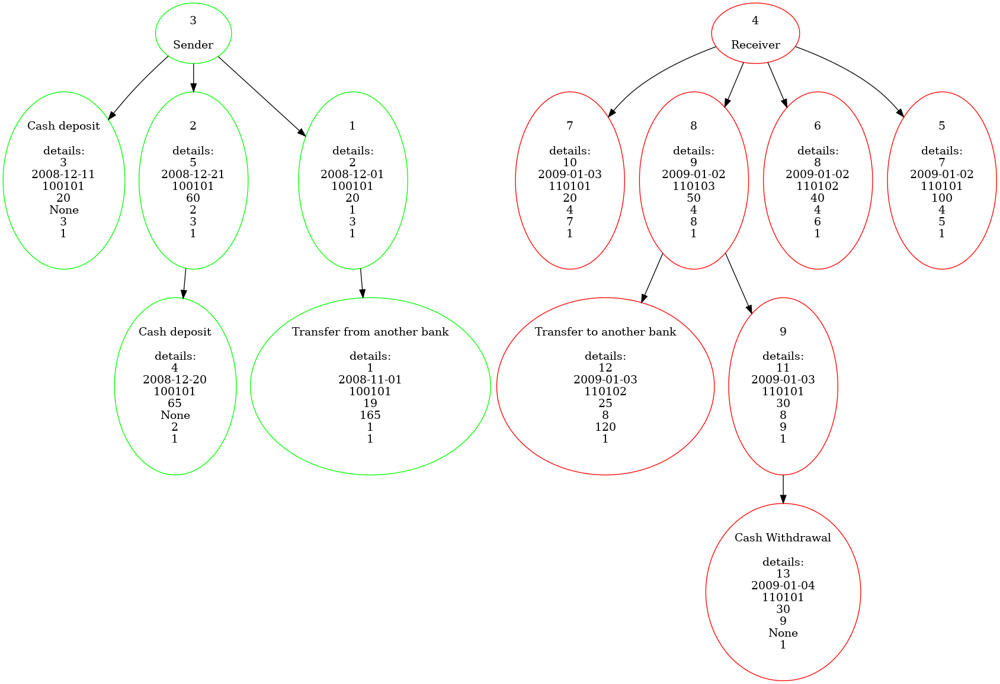
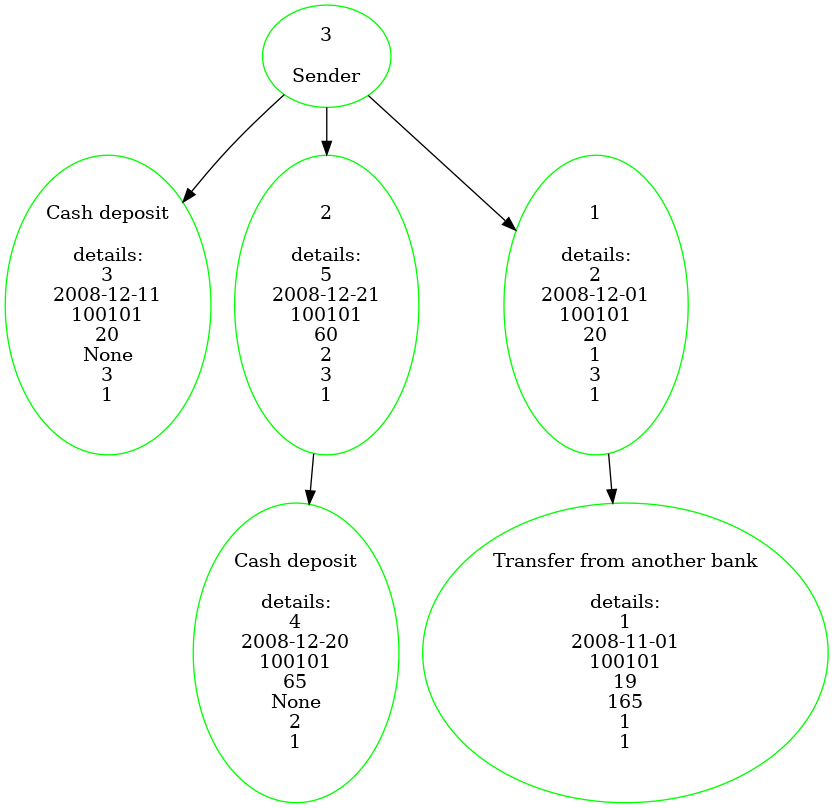
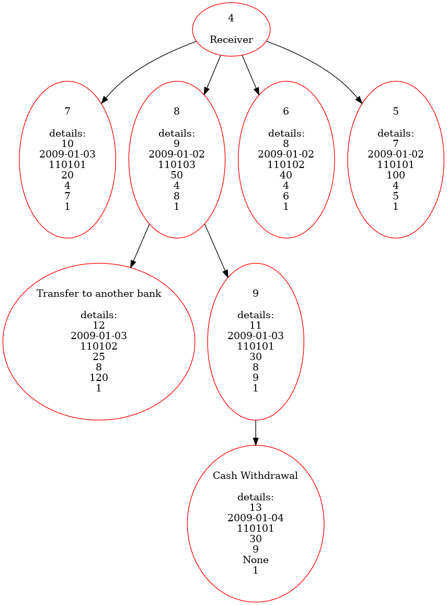

# Bank-system
## Introduction
In this project, the intention was that by first creating a view for the user that includes a validator of the national code entered by the user, we can understand where the money comes from and where it goes by monitoring a transaction.
So, for each transaction, we will have a sequence of transactions that specifies the money's initial origin and final destination in a tree form. Our conditions for finding transactions related to the transaction under review are as follows (for the sake of simplicity, we assume that the transaction under review is called Z, in which account X has transferred the amount of money A to account Y, and after this transaction The first day that Y transfers or withdraws money to another person are called F, and before this transaction, the last day that X receives money from another account or makes a cash deposit is called L:
### 1. Finding traces of money received by Y:
1.1. We must display each of the transactions with a transfer amount precisely equal to A on date F, whose sender is Y.
 <br>
1.2. We have to display each of the transactions on date F whose sender is Y.
 <br>
1.3. All the transactions after the date of F, whose sender is Y, are arranged in ascending order based on the date and we add them one by one so that the sum of their amounts plus the sum of sums of the transactions of step 1.2 exceeds A If the last transaction causes the total amount to exceed A plus 10%, we will not add it.
 <br>
 1.4. We do the same process from 1.1 to 1.4 for the selected transactions.

### 2. Finding traces of money sent by X:
2.1. We should display each of the transactions with a transfer value exactly equal to A on date L, which includes X.
 <br>
 2.2. We should display each of the transactions on date L whose recipient is X.
 <br>
 2.3. We sort all the transactions before date L whose recipient is X in ascending order based on date and add them one by one so that the sum of their amounts plus the sum of sums of transactions in step 1.2 exceeds A If the last transaction causes the total amount to exceed A plus 10%, we will not add it.
 <br>
 2.4. We do the same process from 2.1 to 2.4 for the selected transactions.

## Requerements
Open terminal and execute these commands:
```
sudo apt-get install graphviz
```
```
pip install psycopg2

```
```
pip install anytree
```
## How to use
First, you should set TRANSACTION = "Transaction ID" in line 7 of `Transaction_tree.py`. if you want to see the output transaction tree you should run `Transaction_tree.py`. it will create the sender transaction tree and save it as `sender.png` and create the receiver transaction tree and save it as `receiver.png`. then the program merges these images and makes `result.png` and automatically opens `result.png` as you see:
`result.png`:
<br>


`sender.png`:
<br>


`receiver.png`: 
<br>

